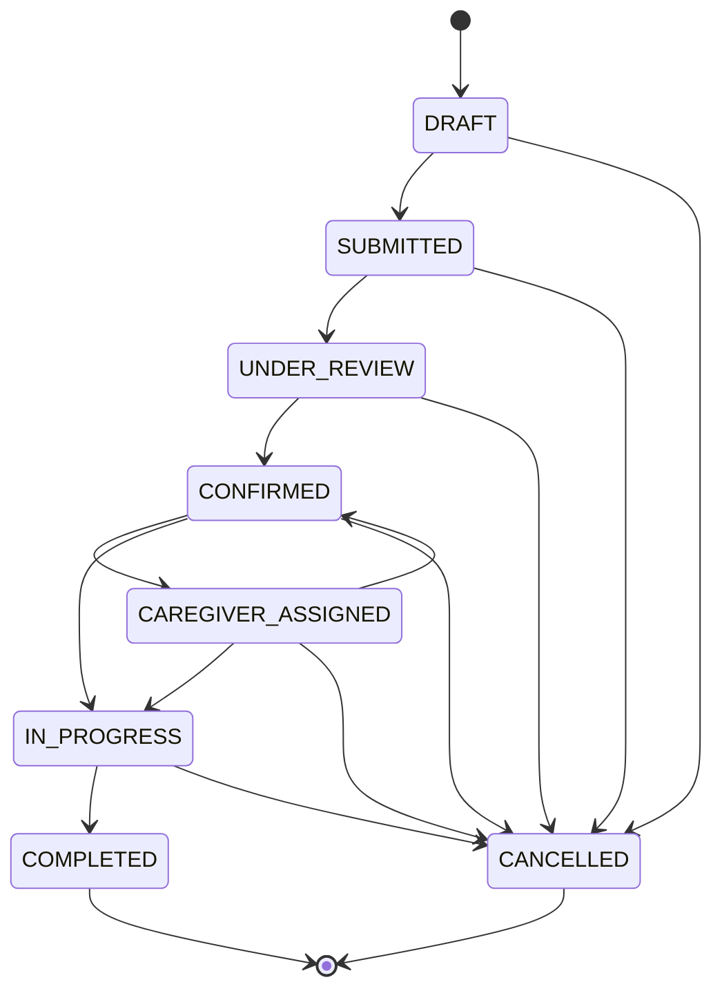
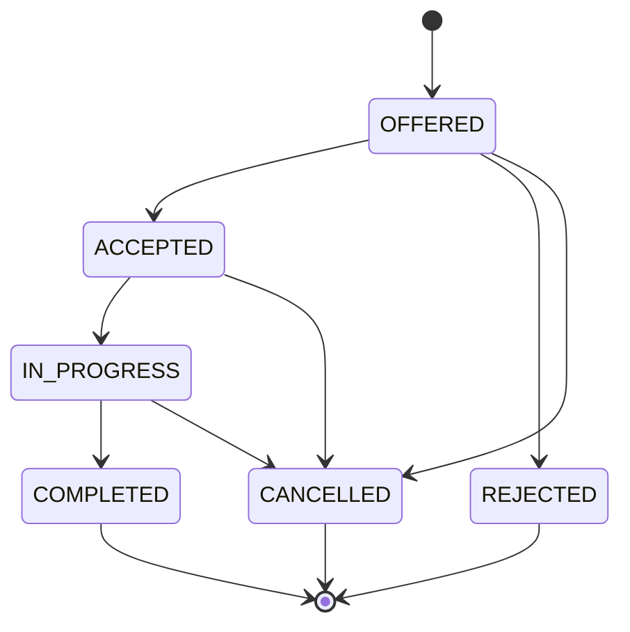

# Status machines

Two lifecycles, both enforced in code. Implementations:

- `src/modules/service-requests/domain/status.ts`
- `src/modules/assignments/domain/status.ts`

Nothing outside those files may decide whether a status change is legal.

---

## Service request

### Allowed transitions

| From                 | To                                            | Who may do it                    | Notes                                                       |
| -------------------- | --------------------------------------------- | -------------------------------- | ----------------------------------------------------------- |
| `DRAFT`              | `SUBMITTED`                                   | Family (owner), Operations       | Family sends the request                                     |
| `DRAFT`              | `CANCELLED`                                   | Family (owner), Operations       |                                                              |
| `SUBMITTED`          | `UNDER_REVIEW`                                | Operations                       | A coordinator picks it up                                    |
| `SUBMITTED`          | `CANCELLED`                                   | Family (owner), Operations       |                                                              |
| `UNDER_REVIEW`       | `CONFIRMED`                                   | Operations                       | Arrangements are set                                         |
| `UNDER_REVIEW`       | `CANCELLED`                                   | Family (owner), Operations       |                                                              |
| `CONFIRMED`          | `CAREGIVER_ASSIGNED`                          | Operations                       | Only when a companion was requested                          |
| `CONFIRMED`          | `IN_PROGRESS`                                 | Operations                       | Transport-only requests skip assignment                      |
| `CONFIRMED`          | `CANCELLED`                                   | Family (owner), Operations       |                                                              |
| `CAREGIVER_ASSIGNED` | `IN_PROGRESS`                                 | Assigned caregiver, Operations   | Caregiver check-in                                           |
| `CAREGIVER_ASSIGNED` | `CONFIRMED`                                   | Operations                       | Un-assign: caregiver declined, request returns to the queue   |
| `CAREGIVER_ASSIGNED` | `CANCELLED`                                   | Family (owner), Operations       |                                                              |
| `IN_PROGRESS`        | `COMPLETED`                                   | Operations                       | Operations closes the request                                |
| `IN_PROGRESS`        | `CANCELLED`                                   | Operations                       | Family cannot cancel a visit already under way               |
| `COMPLETED`          | —                                             | —                                | Terminal                                                     |
| `CANCELLED`          | —                                             | —                                | Terminal                                                     |

### Design notes

- **No self-transitions.** A "change" that changes nothing should not produce an
  audit event or a notification.
- **No reopening.** `COMPLETED` and `CANCELLED` are final. A new request is
  created instead, which keeps each service episode's audit trail intact and
  avoids a status history that loops.
- **`CONFIRMED → IN_PROGRESS` is not a shortcut**; it is the normal path for a
  transport-only request, where there is no companion to assign.
- **`CAREGIVER_ASSIGNED → CONFIRMED`** is deliberately not `→ UNDER_REVIEW`.
  The arrangements are still valid; only the companion needs replacing.
- **Family cannot cancel from `IN_PROGRESS`.** Someone is already travelling.
  Operations handles it, so there is a person in the loop.
- **Role permission is part of the machine.** `canRoleTransition()` answers
  "may this role ever do this?"; the authorization layer separately answers
  "is this their request?". Both must pass.

### Every transition produces

1. An audit event: actor, action, entity type, entity id, from, to, timestamp.
2. A notification, where a template exists — with no sensitive detail in it.

---

## Assignment

### Allowed transitions

| From          | To            | Who may do it       | Notes                                          |
| ------------- | ------------- | ------------------- | ---------------------------------------------- |
| `OFFERED`     | `ACCEPTED`    | Assigned caregiver  | Only they may accept — not operations           |
| `OFFERED`     | `REJECTED`    | Assigned caregiver  | Request returns to `CONFIRMED`                  |
| `OFFERED`     | `CANCELLED`   | Operations          | Offer withdrawn or reassigned                   |
| `ACCEPTED`    | `IN_PROGRESS` | Assigned caregiver  | Check-in                                        |
| `ACCEPTED`    | `CANCELLED`   | Operations          |                                                 |
| `IN_PROGRESS` | `COMPLETED`   | Assigned caregiver  | Check-out                                       |
| `IN_PROGRESS` | `CANCELLED`   | Operations          |                                                 |
| `REJECTED`    | —             | —                   | Terminal. A new offer is a new assignment row    |
| `COMPLETED`   | —             | —                   | Terminal                                        |
| `CANCELLED`   | —             | —                   | Terminal                                        |

### Design notes

- **`OFFERED → IN_PROGRESS` is not allowed.** A caregiver must accept before
  checking in, so consent to the visit is always recorded.
- **Operations cannot accept for a caregiver.** The acceptance record is
  meaningful precisely because only the caregiver can create it.
- **`REJECTED` is terminal.** Re-offering creates a new assignment row, so the
  history shows every offer that was made.
- **Check-out completes the assignment, not the request.** Operations then
  closes the request. Two different people confirming two different things.

---

## How the two interact

| Assignment event                | Effect on the service request           |
| ------------------------------- | --------------------------------------- |
| Assignment created (`OFFERED`)  | `CONFIRMED → CAREGIVER_ASSIGNED`        |
| Caregiver rejects               | `CAREGIVER_ASSIGNED → CONFIRMED`        |
| Caregiver checks in             | `CAREGIVER_ASSIGNED → IN_PROGRESS`      |
| Caregiver checks out            | No automatic change; operations completes the request |
| Operations cancels the request  | Any live assignment → `CANCELLED`       |

Both sides of a linked change happen in one database transaction. A request in
`CAREGIVER_ASSIGNED` with no live assignment is a bug, and the invariant is
worth asserting in tests.
